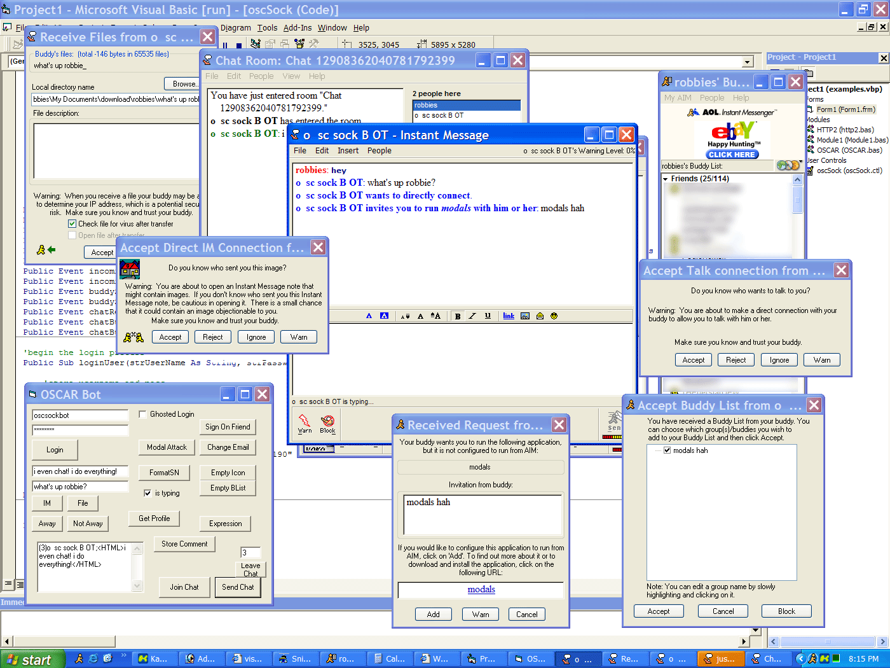



## oscSock 1\.1 \(connect to aim with oscar\!\)

### Description

Connect to AIM and do just about anything, perfect for small bots or full blown clients.
 
### More Info
 
Fever, Vomiting, Rashes

             |
---                |---
**Submitted On**   |2003-02-18 20:05:50
**By**             |[Robbie Saunders](https://github.com/Planet-Source-Code/PSCIndex/blob/master/ByAuthor/robbie-saunders.md)
**Level**          |Advanced
**User Rating**    |4.5 (77 globes from 17 users)
**Compatibility**  |VB 6\.0
**Category**       |[OLE/ COM/ DCOM/ Active\-X](https://github.com/Planet-Source-Code/PSCIndex/blob/master/ByCategory/ole-com-dcom-active-x__1-29.md)
**World**          |[Visual Basic](https://github.com/Planet-Source-Code/PSCIndex/blob/master/ByWorld/visual-basic.md)
**Archive File**   |[oscSock\_1\_155348322003\.zip](https://github.com/Planet-Source-Code/robbie-saunders-oscsock-1-1-connect-to-aim-with-oscar__1-43691/archive/master.zip)

